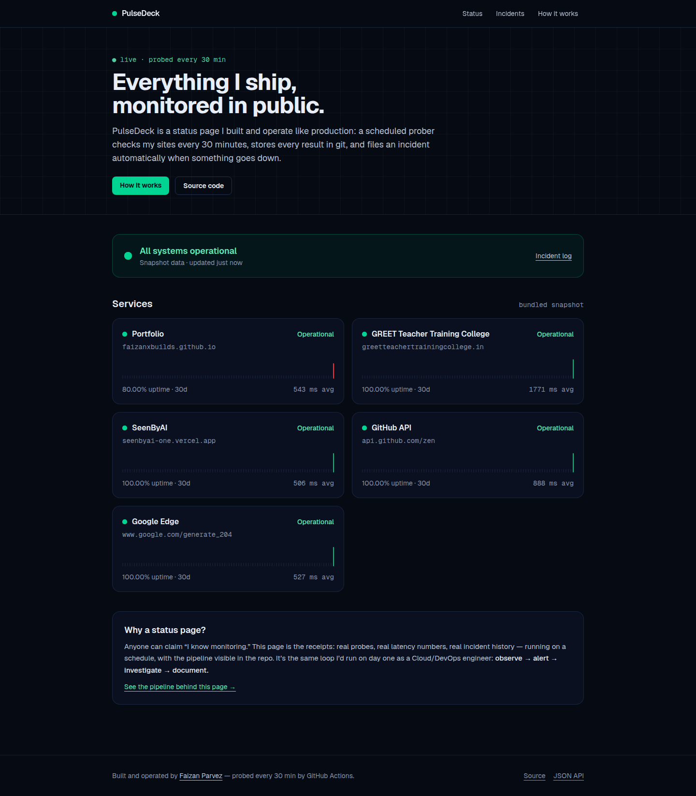

<div align="center">

# PulseDeck

**Everything I ship, monitored in public.**

A live status page I built and operate like production: a scheduled prober checks
my sites around the clock, stores every result in git, and files an incident
automatically when something goes down.

🌐 **Live:** https://faizanxbuilds-status.vercel.app &nbsp;·&nbsp; 📡 **JSON API:** https://faizanxbuilds-status.vercel.app/api/status



</div>

---

## How it works

```
┌─────────┐    ┌──────────┐    ┌─────────┐    ┌─────────┐    ┌─────────┐
│  Probe  │───▶│ Schedule │───▶│  Store  │───▶│  Alert  │───▶│  Serve  │
└─────────┘    └──────────┘    └─────────┘    └─────────┘    └─────────┘
scripts/       GitHub          git itself    GitHub        Next.js
probe.mjs      Actions         data branch   Issues        + Vercel
(zero deps)    scheduled       state.json    auto open/    runtime fetch
               (cron */30)                  close
```

| Stage | What happens |
|-------|--------------|
| **Probe** | `scripts/probe.mjs` (Node, zero dependencies) hits each service with a 10s timeout and records reachability, latency and HTTP status. |
| **Schedule** | `.github/workflows/probe.yml` schedules it every 30 minutes (cron `*/30`). GitHub's scheduler is best-effort so runs actually land every few hours — the site measures the real cadence from probe timestamps and displays that. A concurrency group guarantees two runs never overlap and corrupt state. |
| **Store** | Results land in git itself: rolling samples, daily aggregates and incidents live in `state.json` on an orphan `data` branch. Git is the database — every datapoint is versioned, diffable and auditable. |
| **Alert** | `scripts/sync-issues.mjs` turns probe events into GitHub Issues: an up→down transition opens one, recovery closes it. The full alert → resolve loop with no pager service. |
| **Serve** | The Next.js site ships with a bundled snapshot, then swaps in live state from the `data` branch at runtime via `raw.githubusercontent.com` — fresh data with zero rebuilds per probe. |

## What it monitors

| Service | URL | Why |
|---------|-----|-----|
| Portfolio | faizanxbuilds.github.io | My DevOps portfolio |
| GREET Teacher Training College | greetteachertrainingcollege.in | Production site I built and maintain |
| SeenByAI | seenbyai-one.vercel.app | My indie SaaS MVP |
| GitHub API | api.github.com/zen | Third-party control |
| Google Edge | google.com/generate_204 | Third-party control |

## Design decisions

- **Git as the database** — no database to host, back up or pay for; the monitoring history is automatically auditable.
- **Hot data plane, cold deploy plane** — the site deploys only when code changes; probe data flows through the `data` branch at runtime. 48 probes/day would otherwise mean 48 deploys/day.
- **GitHub Issues for incidents** — timestamped, assignable, commentable, closable by automation. Mirrors real on-call rotations without the PagerDuty bill.
- **30-minute cadence** — a deliberate cost/precision trade-off for brochure sites, staying far inside free-tier limits.

## Run it yourself

```bash
npm install
npm run dev        # site at http://localhost:3000
npm run probe      # run the prober once locally (writes data/state.json)
```

## Project structure

```
pulsedeck/
├── app/                    # Next.js pages: status, service detail, incidents, architecture
├── components/             # StatusDot, UptimeBars, LatencySpark (hand-rolled SVG, no chart lib)
├── lib/                    # service catalog, stats, live-data hook
├── data/state.json          # bundled snapshot (the live one lives on the `data` branch)
├── scripts/
│   ├── probe.mjs           # the prober
│   └── sync-issues.mjs     # incident → GitHub Issue automation
└── .github/workflows/
    ├── probe.yml           # scheduled: probe → issues → commit to data branch
    └── ci.yml              # lint + typecheck + build on every push
```

---

<div align="center">

Built and operated by [Faizan Parvez](https://github.com/Faizan00parvez) · DevOps & Cloud Engineer

</div>
